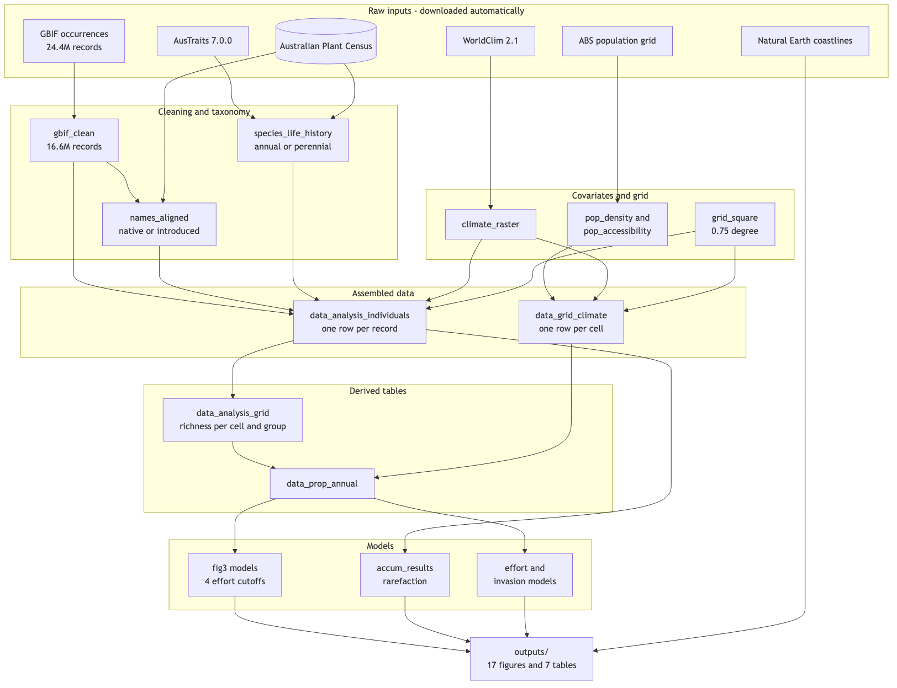

# Annual and perennial plant richness across Australia's rainfall gradient

Code and analysis pipeline for:

> Wenk EH, Cornwell WK, Stephens RE, Coleman D, Mesaglio T, Towers I, Yang S, Falster DS (in prep). *Contrasting climate signals between native and introduced annual and perennial floras.*

## Overview

We analyse how vascular plant species richness varies along Australia's rainfall gradient for four functional-origin groups — native annuals, introduced annuals, native perennials, and introduced perennials — and ask whether the proportion of annuals, and the proportion of introduced species within each growth form, change with mean annual precipitation and rainfall seasonality.

Occurrence records come from GBIF (download [0001494-250914085247600](https://www.gbif.org/occurrence/download/0001494-250914085247600)), life-history classifications from [AusTraits](https://austraits.org) v7.0.0, taxonomy from the Australian Plant Census via [APCalign](https://github.com/traitecoevo/APCalign), and climate from WorldClim 2.1 at 2.5 arcmin. Records are aggregated to a 0.75° grid covering Australia.

---

## Reproducing the analysis

The analysis is a [`targets`](https://books.ropensci.org/targets/) pipeline. From a clean checkout:

```r
install.packages("targets")   # plus the packages listed under Software
targets::tar_make()
```

`tar_make()` downloads every input, cleans 24.4 million occurrence records, builds the analysis grid, fits the models, and writes all figures and tables to `outputs/`.

**No configuration and no manual data placement.** Every raw input is fetched programmatically by `R/download.R`, so there are no machine-specific paths to edit.

Expect roughly **1¼ hours** end to end on a first run: about 45 minutes downloading and 30 minutes computing. Later runs rebuild only what a change actually affects.

### Inspecting the pipeline

```r
targets::tar_make()                       # build whatever is out of date
targets::tar_outdated()                   # what would rebuild, without building
targets::tar_visnetwork()                 # dependency graph
targets::tar_read(data_grid_climate)      # load any intermediate result
targets::tar_meta(fields = "seconds", targets_only = TRUE)   # timings
```

Every intermediate result is addressable by name, so any step can be inspected without rerunning the analysis. `tar_visnetwork()` is the quickest way to see how a given output was derived.

---

## Requirements

### Hardware

| | Needed | Notes |
|---|---|---|
| RAM | **32 GB** | Peak measured 17.4 GB; 16 GB is not sufficient |
| Disk | **~25 GB free** | 19.3 GB for the GBIF download, ~1.3 GB other inputs, ~2 GB object store |
| Cores | any | The pipeline is single-threaded |

Timings below were measured on an Apple M4 (10 cores, 32 GB RAM, SSD) with a sustained download rate of about 95 MB/min.

### Software

- **R ≥ 4.6.0** (tested on 4.6.1)
- **Quarto** — required only to render the `.qmd` documents, not for `tar_make()`

```r
install.packages(c(
  "targets", "tarchetypes", "tidyverse", "terra", "sf", "arrow", "glmmTMB",
  "patchwork", "gridExtra", "furrr", "future", "data.table", "CoordinateCleaner",
  "ozmaps", "rnaturalearth", "geodata", "viridis", "RColorBrewer", "ggnewscale",
  "broom.mixed", "performance", "parameters", "modelbased", "knitr",
  "ragg", "systemfonts", "scales", "openssl", "withr", "waldo"
))

remotes::install_github("traitecoevo/austraits")
remotes::install_github("traitecoevo/APCalign")
```

### Network

A first run downloads about **4.7 GB**, dominated by the GBIF archive. Taxonomic alignment contacts the Australian Plant Census on every rebuild rather than only the first, so a fully offline rebuild is possible only once that step is current.

### Pinned inputs

Each external input is pinned, so the pipeline resolves to the same data over time rather than to whatever the source currently holds:

| Input | Pinned by |
|---|---|
| GBIF occurrences | download key `0001494-250914085247600`; GBIF retains executed downloads |
| Australian Plant Census | release `2026-03-25`, set in `R/align_taxonomy.R` |
| AusTraits | version 7.0.0 (Zenodo `10.5281/zenodo.15718081`) |
| WorldClim | 2.1, 2.5 arcmin |
| ABS population grid | 2011 release, verified by SHA-256 checksum |

Changing the APC release moves species between native and introduced and shifts richness counts, so it is a scientific decision rather than a maintenance one. `APCalign::get_versions()` lists what is available.

The rarefaction analysis uses a fixed random seed, so its results are reproducible across runs and machines.

---

## Benchmarks

Regenerate with:

```r
targets::tar_meta(fields = c("seconds", "bytes"), targets_only = TRUE) |>
  dplyr::filter(!is.na(seconds)) |> dplyr::arrange(dplyr::desc(seconds))
```

Each stage below is the sum of its steps, measured on a warm object store. A first run adds roughly 45 minutes of downloading.

| Stage | Time | Dominated by |
|---|---|---|
| Acquire inputs | ~45 min first run, ~12 s after | GBIF archive (15.3 GB); later runs only re-hash files |
| Clean occurrences and align taxonomy | **14.6 min** | `gbif_clean` 12.2 min, `names_aligned` 1.9 min |
| Build covariates and grid | ~11 s | `pop_raster`, `pop_density`, `global_climate` |
| Assemble analysis data | **6.5 min** | `data_analysis_individuals` 6.2 min |
| Rarefaction | **8.0 min** | `accum_results`, 20 permutations × 1,427 cells |
| Derived tables | ~13 s | `data_analysis_grid` |
| Fit models | ~3 s | 4 effort cutoffs × 3 models, plus 2 standalone |
| Render figures and tables | ~12 s | 17 figures, 7 tables |
| **Total** | **~30 min** | |

The individual steps that take more than ten seconds:

| Step | Time | Output |
|---|---|---|
| `gbif_clean` | 12 min 11 s | 1.04 GB |
| `accum_results` | 7 min 59 s | 89 kB |
| `data_analysis_individuals` | 6 min 13 s | 398 MB |
| `names_aligned` | 1 min 52 s | 1.7 MB |
| `reported_values_table` | 14 s | 1 kB |
| `species_life_history` | 14 s | 238 kB |
| `individuals_filtered` | 13 s | 395 MB |
| `table1` | 13 s | < 1 kB |
| `data_analysis_grid` | 13 s | 34 kB |

Everything else — 82 further steps, including every figure — completes in under six seconds each.

Memory rather than time is the binding constraint: `data_analysis_individuals` peaks at 17.4 GB because every attribute of 16.4 M point records is materialised at once.

File inputs cost only a hash once present — the 15.3 GB GBIF archive is re-checked in 3.4 seconds — so rerunning `tar_make()` is cheap when nothing has changed.

---

## Repository structure

94 targets. `targets::tar_visnetwork()` draws the full interactive graph; the overall shape is:

<picture>
  <source media="(prefers-color-scheme: dark)" srcset="docs/pipeline-dark.png">
  
</picture>

The diagram source is [`docs/pipeline.mmd`](docs/pipeline.mmd). It is committed as
a rendered image rather than a fenced `mermaid` block because GitHub renders
mermaid client-side and intermittently fails with "Unable to render rich display".
After editing the source, regenerate both images with:

```sh
npx @mermaid-js/mermaid-cli -i docs/pipeline.mmd -o docs/pipeline.png      -t default -b white   -w 2400
npx @mermaid-js/mermaid-cli -i docs/pipeline.mmd -o docs/pipeline-dark.png -t dark    -b '#0d1117' -w 2400
```

```
_targets.R              pipeline definition
R/
  download.R            acquires every raw input
  clean_gbif.R          occurrence cleaning and coordinate-quality filters
  align_taxonomy.R      APC alignment; the APC release is pinned here
  life_history.R        AusTraits life-history classification
  climate.R             WorldClim, population density and accessibility
  grid.R                the 0.75° analysis grid
  individuals.R         occurrence x covariate x grid joins
  derived.R             derived analysis tables
  models.R              model fitting and rarefaction
  figures.R             all figures
  outputs.R             writes deliverables to outputs/
  manuscript.R          Tables 1 and S2, and the reported-values check
Dataset_construction.qmd, Analysis.qmd
                        narrative documents describing the analysis
```

---

## Outputs

All written to `outputs/` by `tar_make()`.

**Main figures**

| File | Content |
|---|---|
| `fig1.png` | Rainfall and seasonality maps, Australian climate space, total richness |
| `fig2.png` | Richness maps: annual/perennial by native/introduced |
| `fig3.png` | Fraction annuals and richness against rainfall and seasonality |
| `fig4.png` | Annual fraction as maps and in climate space, with richness |
| `fig5_prop_annuals_accessibility.png` | Introduced fraction of annuals, and population accessibility |

**Supplementary and extended figures**

| File | Content |
|---|---|
| `figS1.png` | Australian against global climate space |
| `figS-100/250/500/1000.png` | Main analysis repeated at each effort cutoff |
| `figS-resample_100/500.png` | Main analysis on effort-standardised richness |
| `figS5.png` | Sampling effort in climate space and geographically |
| `figS6_sampling_effort.png` | Effort distribution and its climate relationships |
| `figE3.png`, `figE4.png` | Richness against rainfall and seasonality, coloured by population accessibility |
| `fig4b.png` | Native-minus-introduced offset in annual fraction |

**Tables**

| File | Content |
|---|---|
| `table1_species_counts.csv` | Species counts by origin and life history |
| `fig3_stats.csv` | Coefficients for the three main models |
| `tableS2_prop_invasive_annual.csv` | Effect of population accessibility on whether an annual is introduced |
| `figS-resample_100/500.csv` | Coefficients on effort-standardised richness |
| `slopes_shift_table.csv` | Raw against effort-standardised slopes |
| `reported_values.csv` | Every value quoted in the manuscript, computed from the pipeline |

`reported_values.csv` allows numbers in the text to be checked against the analysis rather than trusted. Each row gives the value as written in the manuscript, the value the pipeline currently produces, and whether the two differ.

---

## Methodological notes

Points that affect interpretation and are easy to miss when reading the code.

**Grid and climate resolution.** The 0.75° analysis grid aligns exactly with the 2.5 arcmin WorldClim layers, so grid-cell centres fall on the corner between four climate cells. Climate values are extracted by bilinear interpolation, which averages those four.

**Effort is not uniform.** Collecting effort is strongly biased toward wetter, more accessible regions, so raw richness confounds biology with detection probability. The main analysis restricts to cells with at least 500 records; sensitivity to that threshold is reported at 100, 250 and 1000 records, and the analysis is repeated on rarefied richness standardised to common effort.

**Some counts are cell-level.** `n_obs_per_cell` and `n_spp_per_cell` are totals per grid cell, duplicated across the native and introduced rows for that cell. Figures mapping them filter to one group to avoid double-plotting.

**Coordinate cleaning.** Records near country and state centroids, capital cities and biodiversity institutions are removed, using buffers of 5 km, 2 km and 2 km respectively.

**Life history is binary.** Taxa recorded as both annual and perennial — facultative annuals — are counted as annual.

---

## Licence

Code (`R/`, `_targets.R`) is released under the MIT Licence; see `LICENSE`.
Figures, tables and written content (`outputs/`, the `.qmd` documents) are
released under CC BY 4.0; see `LICENSE-CC-BY`. Citation metadata is in
`CITATION.cff`.

This repository redistributes no third-party data at all. GBIF occurrences,
AusTraits, WorldClim, the ABS population grid, Natural Earth outlines and the
Inter typeface are downloaded at build time and carry their own licences.

---

## Contact

Questions about the analysis: William Cornwell, Evolution & Ecology Research Centre, UNSW Sydney.
